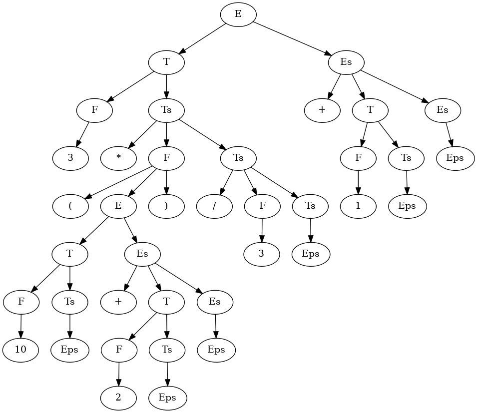

# Parser generator
Программа генерирует парсеры, которые разбирают [LL1](https://ru.wikipedia.org/wiki/LL(1)) грамматику.
Также помимо парсера генерируется лексер, токены и ноды дерева разбора. Для тогочтобы сгенерировать парсер, надо написать LL1 грамматику. Если грамматика не является LL1, будет брошено исключение.

# Аргументы
1) Файл с грамматикой
2) Имя пакета, в который будут помещенны сгенерированные файлы

# Пример генерация парсера, разбирающего арифметические выражения:

## Грамматика
```
START E.

Plus: "+";
Mul: "*";
Div: "/";
Minus: "-";
LBR: "(";
RBR: ")";
Number: %[0-9]+%;
Eps: "eps";

? E: !T !Es<var0.val> {res.val = var1.val;};
? Es[double out1]: Plus !T !Es<var1.val> {res.val = out1 + var2.val;};
? Es[double out1]: Minus !T !Es<var1.val> {res.val = out1 - var2.val;};
? Es[double out1]: Eps {epsNode.val = out1;};
? T: !F !Ts<var0.val> {res.val = var1.val;};
? Ts[double out1]: Mul !F !Ts<var1.val> {res.val = out1 * var2.val;};
? Ts[double out1]: Div !F !Ts<var1.val> {res.val = out1 / var2.val;};
? Ts[double out1]: Eps {epsNode.val = out1;};
? F: LBR !E RBR {res.val = var1.val;};
? F: Number{res.val = Integer.parseInt(var0.getText());};
```

## Входные аргументы
```
expr.txt expr
```

## Генерация
```java
final String src = Files.readString(Paths.get(args[0]));
final Path path = Paths.get("./generated", args[1]);
final String pack = args[1];
try {
    new Generator().run(pack, path, src);
} catch (final GeneratorException e) {
    System.out.println("Error while generating. Cause: " + e.getMessage());
}
```

## Запуск сгенерированного парсера
```java
String input = "3 * (10 + 2) / 3 + 1";
final Parser parser = new Parser(new ByteArrayInputStream((input + " ").getBytes()));
final Node node = parser.parse();
System.out.println(node.val);
```

## Вывод
```bash
13.0
```

## Дерево разбора

